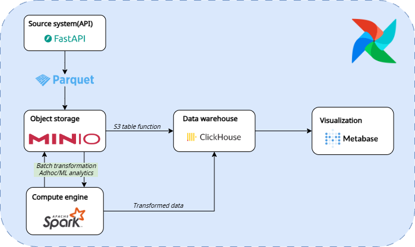

# Data lakehouse on Github Archive Dataset
## Overview

This repository contains a data lakehouse platform designed to process and analyze GitHub Archive data. The platform is composed of multiple services that work together to ingest, store, process, and visualize data. Below is a brief explanation of each service, how they are set up, and how they interact with each other.

## Services

### 1. **API**
- **Description**: A FastAPI-based service that provides an endpoint to download GitHub Archive data for a specified time range. It interacts with a PostgreSQL database to fetch and serve the data.
- **Setup**: 
    - Defined in `api/docker-compose.yml`.
    - Includes a `web-server` for the API and a `db-bootstrap` service to initialize the PostgreSQL database.
    - Environment variables are configured in `.env` files.
- **Interaction**: 
    - The API fetches data from the PostgreSQL database and serves it as `.json.gz` files for downstream processing.

### 2. **Airflow**
- **Description**: Orchestrates the data ingestion pipeline. It downloads data from the API, stores it in MinIO, and loads it into ClickHouse for analytics.
- **Setup**: 
    - Defined in `airflow/docker-compose.yml`.
    - Uses custom DAGs located in the `airflow/dags` directory.
    - Dependencies are specified in `airflow/requirements.txt`.
- **Interaction**: 
    - Pulls data from the API, uploads it to MinIO, and triggers data loading into ClickHouse.

### 3. **MinIO**
- **Description**: An S3-compatible object storage service used to store raw and processed data.
- **Setup**: 
    - Defined in `minio/docker-compose.yml`.
    - Configured with default credentials (`minioadmin`).
- **Interaction**: 
    - Acts as a storage layer for data ingested by Airflow and consumed by other services like ClickHouse & Spark app.

### 4. **ClickHouse**
- **Description**: A columnar data warehouse optimized for analytics. Stores processed GitHub Archive data for querying and analysis.
- **Setup**: 
    - Defined in `clickhouse/docker-compose.yml`.
    - Includes an `initdb` directory for schema initialization.
- **Interaction**: 
    - Airflow loads data in parquet format into ClickHouse from MinIO.
    - Metabase connects to ClickHouse for visualization.

### 5. **Metabase**
- **Description**: A business intelligence tool used to create dashboards and visualize data stored in ClickHouse.
- **Setup**: 
    - Defined in `metabase/docker-compose.yml`.
    - Includes a custom Dockerfile to add the ClickHouse JDBC driver.
- **Interaction**: 
    - Queries data from ClickHouse to generate insights and visualizations.

### 6. **Spark**
- **Description**: A distributed data processing framework used for advanced analytics and transformations.
- **Setup**: 
    - Defined in `spark/docker-compose.yml`.
    - Includes a Spark master, worker nodes, and a Jupyter Notebook for interactive development.
- **Interaction**: 
    - Processes data stored in MinIO or ClickHouse for complex transformations and machine learning tasks.

## How They Work Together

1. **Data Ingestion**: 
     - Airflow triggers the API to fetch GitHub Archive data and stores it in MinIO.
2. **Data Storage**: 
     - MinIO acts as the raw data storage layer.
     - Airflow loads processed data into ClickHouse for analytics.
3. **Data Processing**: 
     - Spark can be used to process data from MinIO or ClickHouse for advanced use cases.
4. **Data Visualization**: 
     - Metabase connects to ClickHouse to create dashboards and visualizations.

## Running the Platform

- Use the `scripts/up-all-services.sh` script to start all services.
- Use the `scripts/down-all-services.sh` script to stop all services.
- Ensure the `gharchive_network` Docker network is created properly before starting the services.

## Prerequisites

- Docker and Docker Compose installed on your system.
- `.env` files configured for each service.

## Directory Structure

- `api/`: API service and PostgreSQL database.
- `airflow/`: Airflow DAGs and configuration.
- `minio/`: MinIO object storage.
- `clickhouse/`: ClickHouse database and schema initialization.
- `metabase/`: Metabase BI tool.
- `spark/`: Spark cluster and Jupyter Notebook for adhoc queries or machine learning analysis.
- `scripts/`: Helper scripts to manage services.

